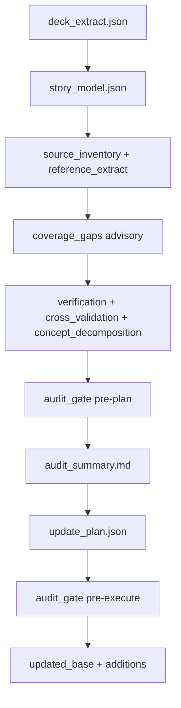

# custtr-storyboard-updater Architecture

Normative rules: [`references/core_rules.md`](references/core_rules.md) (46 rules).  
Workflow: [`references/workflow_phases.md`](references/workflow_phases.md).

## LLM vs script boundary

| Responsibility | Owner |
|----------------|-------|
| Story model, source-to-claim entailment, findings, clears, plan | LLM |
| PPTX extraction, OOXML apply, merge, schema validation | Python |
| Stale-term / scope token scans | Python (signals) |
| Coverage / parity heuristics | Python (advisory lint only) |
| Evidence gates (quoted_source, generational_analysis, reconciliation) | Python |

## Artifact flow

## Hard gates (block advance)

- Schema / field names (`validate_plan.py`, `validate_story_model.py`)
- Every slide in verification + cross_validation coverage
- `quoted_source` substring of `reference_extract`
- `generational_analysis` with source_ids and corpus anchor
- Stale-hit reconciliation
- Notes/OST coherence, original_notes matching
- Post-apply differential scan

## Advisory signals (warn only)

- Low stale-term / concept / action counts (`run_scope_depth_checks`)
- Missing optional parity matrix
- Missing `audit_summary.md` at pre-plan
- Missing `coverage_gap_reconciliation.json` when lint exists
- `coverage_gaps.json` exit code 1 (detector hint, not gate)

## Removed anti-patterns

- Fixed MCP channel minimums
- Legacy require-coverage CLI flag (token overlap as hard gate)
- Heuristic scripts as semantic decision-makers
